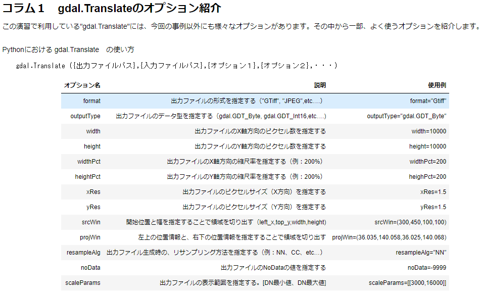

## 学習メモ

[初心者向け Tellus 学習コース](https://tellusxdp.github.io/start-python-with-tellus/)

### GDAL

- 画像の読み込み  
  `変数名 = gdal.Open(<ファイル名>)`

- 読み込んだ画像の表示

  画像を配列情報[Array]に変換し、表示する

  ```
  変数名 = 画像情報.ReadAsArray()
  ```

- 座標系を変換する

  `gdal.Warp()`を使用する

- 画像の切り出し

  - 方法 1: 切り出し開始位置と幅を設定して切り出す

  全体の画像から、「X 方向開始位置」、「Y 方向開始位置」、「X 方向の切り出し幅」、「Y 方向の切り出し幅」を設定することで切り出すことができる。`gdal.Translate()`の`srcWin`オプションを利用する。

  `gdal.Translate(<出力画像名>, <入力画像名>, srcWin=[minX, minY, deltaX, deltaY])`

  - 方法 2: 緯度／経度を指定して切り出す

    - 西の端(minX)
    - 南の端(minY)
    - 東の端(maxX)
    - 北の端(maxY)

  `gdal.Translate()`の`projWin`オプションを利用する。

  `gdal.Translate(<出力画像名>, <入力画像名>, projWin=[minX, minY, deltaX, deltaY])`

- データ形式の変換

  `gdal.Translate(<出力画像名>, <入力画像名>, outputType=<データ型>, scaleParams=[[min,max]])`

  切り出し作業も、同じ gdal.Translate を用いているので、つなげて書くことが可能

  `gdal.Translate(<出力画像名>, <入力画像名>, outputType=<データ型>, scaleParams=[[min,max]], srcWin=[minX,minY,deltaX,deltaY])`

- フォーマットの変換

  `gdal.Translate`を用いて、以下のように書く。

  `gdal.Translate(<出力画像名>, <入力画像名>, format=<フォーマット名>, widthPct=<X方向の拡大/縮小パーセンテージ>, heightPct=<Y方向の拡大/縮小パーセンテージ>)`

- gdal.Translate

  

### 衛星データ

- 近赤外域帯域の反射率は、植物が持つクロロフィルの活性度と正の相関があるため、植生が多いところで、画像のピクセル値は高くなる。

- カラー合成  
  トゥルーカラー画像とは、人間の目で見える色と同じ配合で作成される画像のこと。  
  衛星画像の赤の波長を赤バンドに、緑波長を緑バンドに、青波長を青バンドに割り当てた画像になる。

  フォールスカラー画像とは、植生部分を赤く表示させた画像のこと。  
  人間の目は「赤色が強調されて見える」といった特性を利用して、植生の様子を詳細に把握することができる。  
  近赤外の波長を赤バンドに、赤の波長は緑バンドに、緑の波長を青バンドに割り当てた画像をフォールスカラーと呼ぶ。

  ナチュラルカラー画像とは、植生を自然な色合いで強調した画像のこと。  
  赤の波長を赤バンドに、近赤外の波長を緑バンドに、緑の波長を青バンドに割り当てる。

- バンド演算
  植生指数　： 赤＋近赤外
  積雪　　　： 緑＋短赤外
  土壌の粒度： 赤＋緑＋青
  都市化　　： 近赤外＋短赤外

- NDWI
  Normalized Difference Water Index(NDWI)は地表の水系を解析するために用いられる。水は青の波長を赤や緑の波長より反射する特性があり、特に透き通った水に対して、青の波長はよく反射されることが知られている。近年ではこれらの指標を修正した Modified Normal Difference Water Index(MNDWI)が利用され、地表からのさまざまなノイズ（植生や砂地など）を低減し、水域を強調しやすくなっている。

  - MNDWI = (Green – SWIR) / (Green + SWIR)
    Sentinel-2 であれば、band3 と band11 を利用することになる

  - MNDWI = (Band 3 – Band 11) / (Band 3 + Band 11)

  通常、海や河川は 0.5 辺りの値となり、植物に含まれる水分はそれより低くなる傾向があるため、分離はし易いことが知られている。また市街地もプラス寄りの値をとることが多い。
